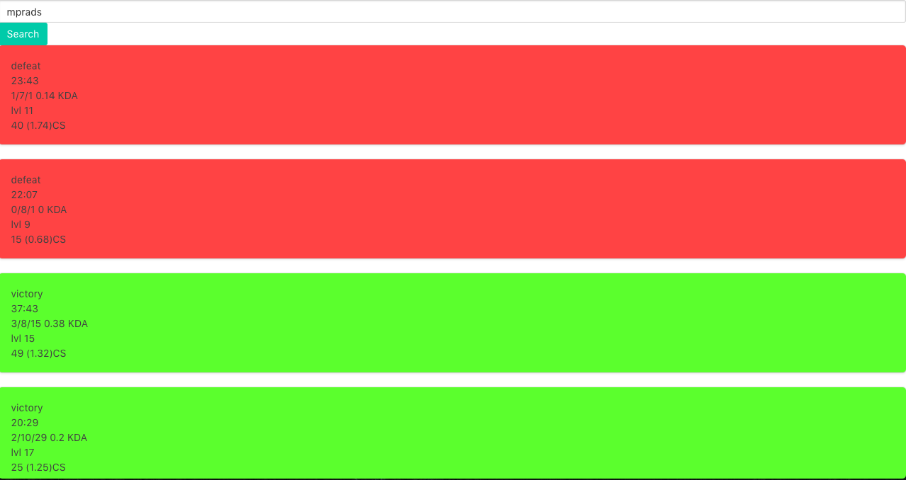

# battlefy-setup
Setup for battlefy tech test
npm i 
Create .env from example
npm run start to run the app with nodemon. 
Express defaults to 8080 and the webpack-dev-server runs on 3000
Go to http://localhost:8080 to test the app
npm run production will also build a bundle and start the express server on localhost:8080

There is currently still the rate limiting issue, given more time I would try to implement a redis server 
to cache my request and have a sever side script that makes requests to the riot api checking the rate limit before each request goes out.

I would also greatly improve error handling on failed request to give the user a notification.
The search function needs to be improved, it does not handle spaces, forgot to add trim and also was not aware
summoner names could have spaces in them.

I would add more routers to the api index and create controllers to remove logic from in the routes.

I would also like to break the match component into smaller components making the file less busy and easier to refactor

